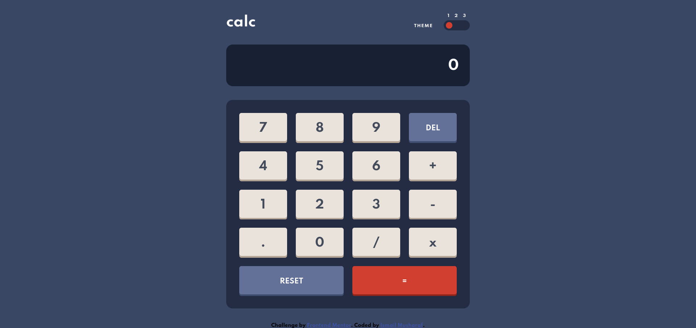
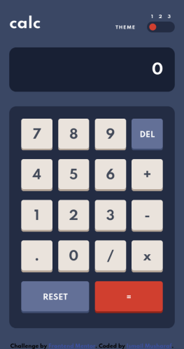
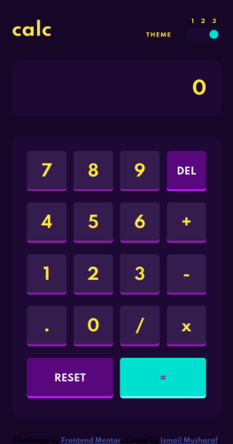
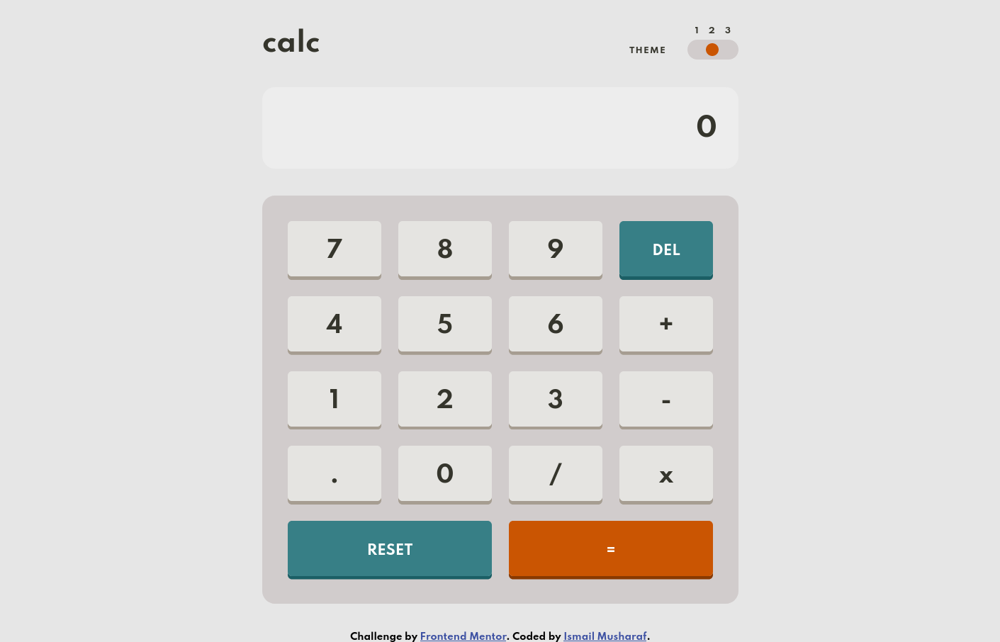

# Frontend Mentor - Calculator app solution

This is a solution to the [Calculator app challenge on Frontend Mentor](https://www.frontendmentor.io/challenges/calculator-app-9lteq5N29). Frontend Mentor challenges help you improve your coding skills by building realistic projects. 

## Table of contents

- [Overview](#overview)
  - [The challenge](#the-challenge)
  - [Screenshot](#screenshot)
  - [Links](#links)
- [My process](#my-process)
  - [Built with](#built-with)
  - [What I learned](#what-i-learned)
  - [Continued development](#continued-development)
  - [Useful resources](#useful-resources)
- [Author](#author)
- [Acknowledgments](#acknowledgments)

## Overview

### The challenge

Users should be able to:

- See the size of the elements adjust based on their device's screen size
- Perform mathmatical operations like addition, subtraction, multiplication, and division
- Adjust the color theme based on their preference
- **Bonus**: Have their initial theme preference checked using `prefers-color-scheme` and have any additional changes saved in the browser

### Screenshot






### Links

- Solution URL: [GitHub Repo](https://github.com/ismailmushraf/calculator-app)
- Live Site URL: [Live Website](https://micoder.me/calculator-app)

## My process

### Built with

- Semantic HTML5 markup
- CSS custom properties
- CSS Grid
- Mobile-first workflow

### What I learned

Some of the Things I've Learned from working on this Project, see below:

#### Semantic HTML
```html
<header>Header consist of themeToggler and Heading</header>
<main>Main consist of Keypad</main>
```
Semantic HTML is the use of HTML markup to reinforce the semantics, or meaning, of the information in webpages and web applications rather than merely to define its presentation or look. 

#### CSS Transition
```css
#themeToggler {
  transition: margin-left .5s;
}
```
- Here, the first parameter `margin-left` is the property we need to add an animation to.
- Second parameter `.5s` is the duration of the animation

#### Grid Display
```css
.keypad {
  display: grid;
  grid-template-columns: 1fr 1fr 1fr 1fr;
}
```
- `fr` stands for "fraction of available space". It divides the space into equal number of parts.
- `1fr` takes 25% of this space. Because there are 4 cols in a row. `100% / 4 = 25%`.

#### Centering Items vertically and horizontally
```css
.num-key {
  align-items: center;
  justify-content: center;
}
```
This helped me to center the keypad numbers vertically and horizontally centered in the div.


```js
const proudOfThisFunc = () => {
  console.log('🎉')
}
```

If you want more help with writing markdown, we'd recommend checking out [The Markdown Guide](https://www.markdownguide.org/) to learn more.

**Note: Delete this note and the content within this section and replace with your own learnings.**

### Continued development

Use this section to outline areas that you want to continue focusing on in future projects. These could be concepts you're still not completely comfortable with or techniques you found useful that you want to refine and perfect.

**Note: Delete this note and the content within this section and replace with your own plans for continued development.**

### Useful resources

- [Example resource 1](https://www.example.com) - This helped me for XYZ reason. I really liked this pattern and will use it going forward.
- [Example resource 2](https://www.example.com) - This is an amazing article which helped me finally understand XYZ. I'd recommend it to anyone still learning this concept.

**Note: Delete this note and replace the list above with resources that helped you during the challenge. These could come in handy for anyone viewing your solution or for yourself when you look back on this project in the future.**

## Author

- Website - [Add your name here](https://www.your-site.com)
- Frontend Mentor - [@yourusername](https://www.frontendmentor.io/profile/yourusername)
- Twitter - [@yourusername](https://www.twitter.com/yourusername)

**Note: Delete this note and add/remove/edit lines above based on what links you'd like to share.**

## Acknowledgments

This is where you can give a hat tip to anyone who helped you out on this project. Perhaps you worked in a team or got some inspiration from someone else's solution. This is the perfect place to give them some credit.

**Note: Delete this note and edit this section's content as necessary. If you completed this challenge by yourself, feel free to delete this section entirely.**
